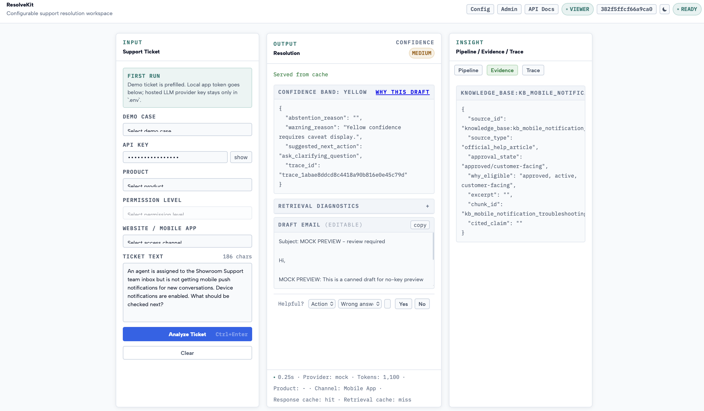
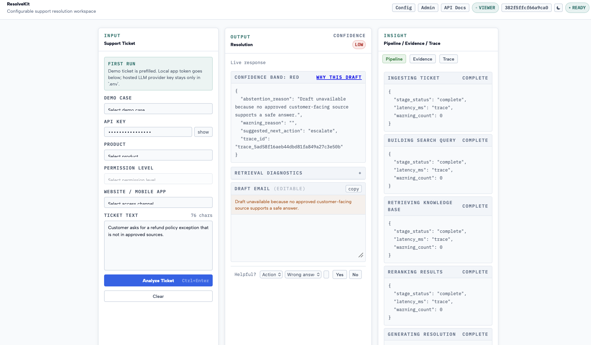

# ResolveKit

ResolveKit is a frozen support-AI reference project for drafting customer support replies from approved knowledge sources.

**Current status:** Frozen reference implementation. Local demo only; not production-ready, not actively maintained, and not positioned as a support automation product.

## Why I Made It

I built ResolveKit to explore RAG hands-on and understand what a reusable support-AI workflow would need before it could be trusted. The goal was not to ship a production agent; it was to learn the moving parts well enough to reuse the method for research and future prototypes without starting from scratch every time.

The project explores approved-source retrieval, cited drafting, validation, trace review, human approval, feedback capture, and evaluation.

## UI Examples

Reviewable draft path:



Abstention path:



## Project Status: Frozen Reference Implementation

ResolveKit can demonstrate the workflow: approved-source retrieval, cited draft generation, validation, trace review, and human approval.

The evaluation results were not strong enough to justify production use. The weak points were retrieval/source precision, required-point coverage, confidence calibration, knowledge-base quality, and repeatability across ambiguous support tickets.

The main outcome was learning what needs to be measured before a support-AI workflow can be trusted: source quality, retrieval precision, citation grounding, coverage of required answer points, confidence calibration, review warnings, and human feedback.

## Portfolio Summary

ResolveKit demonstrates:

- Support workflow design: suggest-only drafts, human review, no auto-send
- RAG fundamentals: source ingest, retrieval, reranking, citations
- Safety controls: approved-source filtering, abstention, validation, traceability
- Evaluation thinking: golden cases, source precision, required-point coverage, confidence checks
- Operations visibility: traces, feedback, knowledge gaps, and review metrics

## What This Is

- Local/self-hosted reference implementation
- Support-AI workflow exploration
- CSV-first support knowledge ingest
- Cited draft suggestions for support reviewers
- Confidence, abstention, validation, and redacted traces
- Human review required before any customer response

## What This Is Not

- Not production-ready
- Not a deployable AI support agent
- Not a customer chatbot or helpdesk replacement
- Not auto-send, auto-resolve, mutate customer accounts, or account action
- Not a source-of-truth editor
- Not hosted SaaS or multi-tenant software
- Raw tickets are never cited as evidence

Hard boundary: ResolveKit never auto-sends replies, mutates customer accounts, or treats raw tickets as customer-facing knowledge. Use `/resolve` with `mode: "suggest"` and review every draft.

## Evaluation Outcome

Current stored eval status:

<!-- eval-report:start -->
| Metric | Current value |
| --- | ---: |
| Demo readiness | passed |
| Golden cases | 52 |
| Source-safety hard failures | 0 |
| Validation/review warnings | 12 |
| Recall@3/5 | 0.6596 |
| Source precision | 0.4716 |
| Citation precision | 1 |
| Required-point coverage | 0.0577 |
| Total eval cost | 0.0232 USD |
| Production readiness | not approved |
<!-- eval-report:end -->

### Interpretation

These results are intentionally included because they show the trust gap in support-AI systems.

The project reached demo readiness, but the evaluation exposed weaknesses in retrieval precision, answer coverage, and confidence calibration. This means the workflow is useful as a reference/demo, but not reliable enough for production support automation.

Metric decimals are ratios from 0 to 1, where `1` means perfect for that check. For example, `Recall@3/5 = 0.6596` means about 66% of expected evidence was found in the top retrieved results, `Source precision = 0.4716` means about 47% of cited/retrieved sources were the expected ones, and `Required-point coverage = 0.0577` means the draft covered only about 6% of required answer points.

## How It Works

```text
Ticket -> Retrieval Plan -> Approved Sources -> Rerank -> Evidence Bundle -> Draft -> Validate -> Confidence -> Trace/Review
```

Happy path:

- Load approved customer-facing knowledge
- Submit a support ticket
- Inspect the cited draft, confidence, validation status, and trace
- Decide what a human reviewer should send

Safety path:

- Missing context should lead to abstention or review
- Raw tickets, chats, calls, and emails are not customer-facing evidence
- Unsupported claims are blocked or flagged

## Quick Start

The quick start is intended for local demo/review only. It is not a production deployment guide. Docker is the recommended path.

```bash
git clone <repo-url>
cd <repo-directory>
cp .env.docker.example .env.docker
./get_started.sh
make doctor
```

The onboarding wizard opens at:

```text
Onboarding wizard: http://127.0.0.1:8765
Ticket workspace:  http://127.0.0.1:8000/
```

Use an OpenAI/Gemini key, or set `ACTIVE_PROVIDER=mock` in `.env.docker` for a no-key preview. You're set up when `make doctor` prints `Demo readiness: READY`.

Doctor summary:

```text
Demo readiness: READY
Production readiness: NOT READY
```

## What I Learned

- RAG quality is mostly an operational/data-quality problem, not just an LLM problem.
- Approved-source governance matters; raw support tickets should not automatically become customer-facing evidence.
- Citations alone are not enough. A support-AI workflow also needs validation, abstention, review warnings, and traceability.
- Evaluation should measure retrieval quality, citation precision, required-point coverage, review warnings, confidence calibration, and cost.
- Bad or vague labels make downstream analytics and automation unreliable.
- Before attempting automation, support teams need a cleaner taxonomy, labeled examples, and measurable baselines.

## What I Would Do Differently Next

If continuing this work, I would focus less on adding features and more on the evaluation/data layer:

1. Build a cleaner labeled support-ticket dataset.
2. Define a smaller taxonomy of ticket intents, product areas, and resolution paths.
3. Create human-reviewed golden cases.
4. Compare existing support labels against human-reviewed labels.
5. Compare LLM labels against classical ML baselines.
6. Measure where labels are wrong, missing, vague, or inconsistent.
7. Use those findings to improve support analytics before attempting automation.

## Follow-On Direction

ResolveKit showed that support-AI drafting cannot be trusted without better measurement.

The follow-on direction is a support-ticket intelligence pipeline focused on:

- Cleaning and assembling support case text
- Defining a practical support taxonomy
- Human-reviewing a sample of tickets
- Measuring existing label quality
- Comparing existing CRM labels, LLM labels, and classical ML baselines
- Producing clearer support analytics before attempting automation

In short: ResolveKit explored the AI drafting layer; the next step is building the data and evaluation layer that support automation would depend on.

## Privacy Boundary

Do not load private customer data into a public or shared instance. Ticket text and retrieved KB snippets go to the configured provider, OpenAI or Gemini. KB chunks, traces, and doctor reports stay in the local Postgres volume and trace store. Hashed tickets, not raw tickets, enter traces. local-first doesn't mean offline. Exposing beyond localhost exposes traces and admin analytics.

## More Technical Detail

- [Technical Guide](docs/TECHNICAL.md): architecture, API contracts, config, ingest, safety rules, metrics, and verification commands.
- [Demo Guide](docs/DEMO.md): demo script, sample tickets, expected behavior.
- [Code Map](docs/CODE_MAP.json): compact machine-readable map for reviewers.

Core code lives in `frontend/`, `backend/api/`, `backend/core/`, `backend/providers/`, `pipeline/`, `knowledge_loader/`, and `scripts/`.

## AI Transparency And Ethics

This codebase and its documentation were substantially generated with AI assistance and then reviewed through tests and local smoke runs. LLM-generated drafts are suggestions for human review. ResolveKit does not claim ownership over deployer prompts, private source content, tickets, or final customer replies.

## License

MIT. See [LICENSE](LICENSE).
