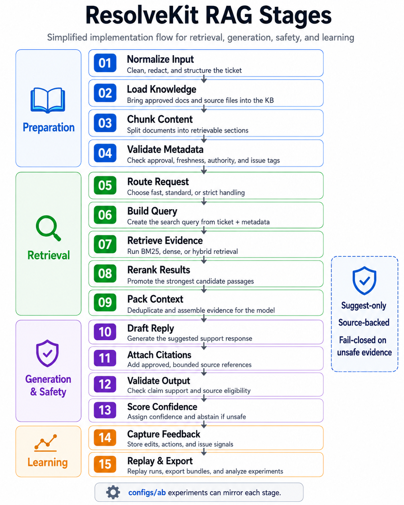
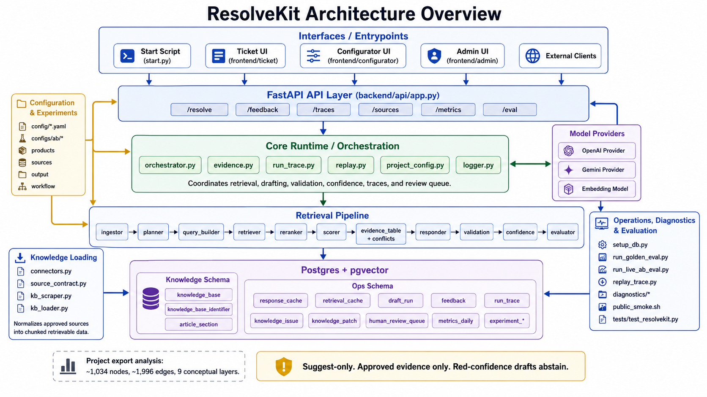

# ResolveKit

ResolveKit is a local-first support-AI reference project for drafting customer support replies from approved knowledge sources.

It is not a production-ready support automation system. It is a completed learning project that explores safe support-AI workflow design: approved-source retrieval, cited drafts, validation, trace review, human approval, and evaluation.

## Project Status: Frozen Reference Implementation

ResolveKit is frozen as a completed reference project. It remains available as a local Docker demo and portfolio artifact, but it is not being positioned as a maintained production product.

The main outcome was not proving that AI can reliably resolve support tickets. The main outcome was learning what needs to be measured before a support-AI workflow can be trusted: source quality, retrieval precision, citation grounding, coverage of required answer points, confidence calibration, review warnings, and human feedback.

Because the evaluation showed quality gaps, ResolveKit is frozen as a local demo/reference implementation instead of being positioned as a production product.

## Portfolio Summary

ResolveKit demonstrates:

- Support workflow design: suggest-only drafts, human review, no auto-send
- RAG fundamentals: source ingest, retrieval, reranking, citations
- Safety controls: approved-source filtering, abstention, validation, traceability
- Evaluation thinking: golden cases, source precision, required-point coverage, confidence checks
- Operations visibility: traces, feedback, knowledge gaps, and review metrics

The project is intentionally framed as a learning/reference implementation because evaluation showed quality gaps that would need to be solved before production use.

## What This Is

- Local/self-hosted reference implementation
- Support-AI workflow exploration
- CSV-first support knowledge ingest
- Cited draft suggestions for support reviewers
- Confidence, abstention, validation, and redacted traces
- Human review required before any customer response

## What This Is Not

- Not production-ready
- Not a deployable AI support agent
- Not a customer chatbot or helpdesk replacement
- Not auto-send, auto-resolve, mutate customer accounts, or account action
- Not a source-of-truth editor
- Not hosted SaaS or multi-tenant software
- Raw tickets are never cited as evidence

Hard boundary: ResolveKit never auto-sends replies, mutates customer accounts, or treats raw tickets as customer-facing knowledge. Use `/resolve` with `mode: "suggest"` and review every draft.

## Non-Goals

ResolveKit does not aim to:

- Automatically send replies to customers
- Replace support agents
- Prove that RAG can fully resolve support tickets
- Serve as a production SaaS product
- Use raw ticket history as approved customer-facing truth
- Hide weak evaluation results

## Why This Matters

In support operations, the hard problem is not generating a fluent answer. The hard problem is knowing whether the answer is grounded, complete, safe, and based on approved information.

ResolveKit explores that trust layer through citations, validation, confidence checks, trace review, and evaluation.

## AI Transparency And Ethics

This codebase and its documentation were substantially generated with AI assistance and then reviewed through tests and local smoke runs. LLM-generated drafts are suggestions for human review. ResolveKit does not claim ownership over deployer prompts, private source content, tickets, or final customer replies.

## Quick Start

The quick start is intended for local demo/review only. It is not a production deployment guide. Docker is the recommended path.

```bash
git clone <repo-url>
cd <repo-directory>
cp .env.docker.example .env.docker
./get_started.sh
make doctor
```

The onboarding wizard opens at:

```text
Onboarding wizard: http://127.0.0.1:8765
Ticket workspace:  http://127.0.0.1:8000/
```

Use an OpenAI/Gemini key, or set `ACTIVE_PROVIDER=mock` in `.env.docker` for a no-key preview.

You're set up when:

- `make doctor` prints `Demo readiness: READY`
- The ticket workspace opens at `http://127.0.0.1:8000/`
- The demo ticket returns a draft with citations
- Confidence and validation status are visible

Doctor summary:

```text
Demo readiness: READY
Production readiness: NOT READY
```

Useful commands:

| Command | Use |
| --- | --- |
| `make get-started` | First-time Docker onboarding |
| `make doctor` | Local readiness check |
| `bash scripts/public_smoke.sh` | Public smoke test |
| `python start.py` | Advanced local Python path |

Supported hosted providers are `openai` and `gemini`. Required local config names include `OPENAI_API_KEY` or `GEMINI_API_KEY`, `API_KEY`, `CONFIGURATOR_API_KEY`, `VIEWER_TOKEN`, `CONFIGURATOR_ADMIN_TOKEN`, `CONFIGURATOR_PREFILL_API_KEY=false`, `CORS_ALLOW_ORIGINS`, `KNOWLEDGE_SCHEMA`, and `OPS_SCHEMA`; start from `.env.docker.example`.

Local embedding and reranker startup checks run through `backend/providers/model_warmup.py`. Set `WARM_LOCAL_MODELS=false` to keep lazy loading enabled without warming those models at startup; Docker uses this setting by default.

Operational tokens:

- `API_KEY`: viewer/API token for ticket workspace requests.
- `CONFIGURATOR_API_KEY`: admin/configurator token; must differ from `API_KEY`.
- `VIEWER_TOKEN`: trace viewer token; must be non-placeholder.
- `CONFIGURATOR_ADMIN_TOKEN`: elevated admin token; must differ from viewer keys.

Use distinct random values of at least 12 characters. Do not leave placeholders such as `change-me` or `change-me-configurator`.

Config map:

| File / Surface | Purpose | User Should Edit? | Takes Effect |
| --- | --- | --- | --- |
| `.env.docker` | Provider keys, DB, runtime secrets for Docker | Yes | Restart containers |
| `.env` | Provider keys, DB, runtime secrets for local Python | Advanced | Restart |
| `config/products.yaml` | Product identity, aliases, platforms, roles | Yes | Restart/reload |
| `config/sources.yaml` | Source registry, paths, policy | Yes | Re-ingest for source changes |
| `config/output.yaml` | Draft tone and visible sections | Yes | Live/next resolve |
| `config/retrieval_policy.yaml` | Retrieval weights and chunking rules | Advanced | Restart or re-ingest by field |
| `config/workflow.yaml` | Suggest-only workflow behavior | Rarely | Live/next resolve |

## Bring Your Own CSV

The reference implementation supports CSV and XLSX preview/validation, while the documented demo path remains CSV-first.

Start from `demo_data/onboarding/source_manifest_template.csv`. A valid demo CSV must include these columns:

```text
source_id,source_title,source_type,source_authority,is_approved,is_active,is_customer_facing_allowed,approved_at,reviewed_by,needs_review_at,doc_type,product_area,issue_class,version_scope,escalation_risk,body
```

Controlled values:

| Field | Values |
| --- | --- |
| `source_type` | `csv`, `xlsx`, `pdf` |
| `source_authority` | `canonical`, `approved`, `conditional` |
| `doc_type` | `faq`, `troubleshooting`, `policy`, `release_note`, `known_issue`, `api_reference` |
| `escalation_risk` | `low`, `medium`, `high` |
| Boolean flags | `true`/`false`; `1`/`0` and `yes`/`no` also validate |
| Date fields | ISO dates or datetimes, for example `2026-01-01` |

Rows are retrievable only when `is_approved=true`, `is_active=true`, `is_customer_facing_allowed=true`, and `body` is non-empty. Approved rows also require `approved_at` and `reviewed_by`.

Minimal row:

```csv
source_id,source_title,source_type,source_authority,is_approved,is_active,is_customer_facing_allowed,approved_at,reviewed_by,needs_review_at,doc_type,product_area,issue_class,version_scope,escalation_risk,body
kb_001,Password Reset Guide,csv,canonical,true,true,true,2026-01-01,support_ops,2027-01-01,faq,login,password_reset,v1,low,Customers can reset passwords from account settings after verifying email ownership.
```

Validate before loading:

```bash
.venv/bin/python scripts/validate_sources.py demo_data/csv/minimal_valid_kb.csv
```

Examples live in `demo_data/csv/minimal_valid_kb.csv`, `demo_data/csv/resolvekit_demo_kb.csv`, and `demo_data/csv/invalid_examples/`.

## Evaluation Outcome

ResolveKit can demonstrate the workflow: approved-source retrieval, cited draft generation, validation, trace review, and human approval.

However, the evaluation results were not strong enough to justify production use.

The main weak points were:

- Retrieval/source precision
- Required-point coverage
- Confidence calibration
- Knowledge base quality
- Repeatability across ambiguous support tickets

This is why ResolveKit remains suggest-only and human-reviewed.

## Demo Readiness

Current stored eval status:

<!-- eval-report:start -->
| Metric | Current value |
| --- | ---: |
| Demo readiness | passed |
| Golden cases | 52 |
| Source-safety hard failures | 0 |
| Validation/review warnings | 12 |
| Recall@3/5 | 0.6596 |
| Source precision | 0.4716 |
| Citation precision | 1 |
| Required-point coverage | 0.0577 |
| Total eval cost | 0.0232 USD |
| Production readiness | not approved |
<!-- eval-report:end -->

Treat these as final reference-project metrics, not a production claim. Retrieval quality still needs work before production use: warnings are too high, source precision is below target, and required-point coverage is low.

### Interpretation

These results are intentionally included because they show the trust gap in support-AI systems.

The project reached demo readiness, but the evaluation exposed weaknesses in retrieval precision, answer coverage, and confidence calibration. This means the workflow is useful as a reference/demo, but not reliable enough for production support automation.

Metric decimals are ratios from 0 to 1, where `1` means perfect for that check. For example, `Recall@3/5 = 0.6596` means about 66% of expected evidence was found in the top retrieved results, `Source precision = 0.4716` means about 47% of cited/retrieved sources were the expected ones, and `Required-point coverage = 0.0577` means the draft covered only about 6% of required answer points.

`make doctor` runs Docker checks, config checks, secret/local-path hygiene, focused tests, stored evaluation, Docker smoke, and onboarding endpoint checks. Reports are written under `diagnostics/demo_doctor/`; keep generated diagnostics local unless you have reviewed them for private source content.

Logs live under `diagnostics/logs/` and app stdout. Review logs and doctor reports for private source content before sharing them.

## How It Works

```text
Ticket -> Retrieval Plan -> Approved Sources -> Rerank -> Evidence Bundle -> Draft -> Validate -> Confidence -> Trace/Review
```



Happy path:

- Load approved customer-facing knowledge
- Submit a support ticket
- Inspect the cited draft, confidence, validation status, and trace
- Decide what a human reviewer should send

Safety path:

- Missing context should lead to abstention or review
- Raw tickets, chats, calls, and emails are not customer-facing evidence
- Unsupported claims are blocked or flagged

## Privacy Boundary

Do not load private customer data into a public or shared instance. Ticket text and retrieved KB snippets go to the configured provider, OpenAI or Gemini. KB chunks, traces, and doctor reports stay in the local Postgres volume and trace store. Hashed tickets, not raw tickets, enter traces. local-first doesn't mean offline. Exposing beyond localhost exposes traces and admin analytics.

## Common Failures

| Failure | Expected Behavior |
| --- | --- |
| Missing provider key | Names the exact missing env var |
| Docker not running | Says Docker is required for quick start |
| Port 8000/8765 in use | Shows the conflict and fix |
| Bad CSV row | Names row, column, and expected value |
| No approved sources | Says rows were excluded by source flags |
| Unsupported ingest file | Names supported preview formats and points to the template |

## What I Learned

- RAG quality is mostly an operational/data-quality problem, not just an LLM problem.
- Approved-source governance matters; raw support tickets should not automatically become customer-facing evidence.
- Citations alone are not enough. A support-AI workflow also needs validation, abstention, review warnings, and traceability.
- Evaluation should measure retrieval quality, citation precision, required-point coverage, review warnings, confidence calibration, and cost.
- Bad or vague labels make downstream analytics and automation unreliable.
- Before attempting automation, support teams need a cleaner taxonomy, labeled examples, and measurable baselines.

## What I Would Do Differently Next

If continuing this work, I would focus less on adding features and more on the evaluation/data layer:

1. Build a cleaner labeled support-ticket dataset.
2. Define a smaller taxonomy of ticket intents, product areas, and resolution paths.
3. Create human-reviewed golden cases.
4. Compare existing support labels against human-reviewed labels.
5. Compare LLM labels against classical ML baselines.
6. Measure where labels are wrong, missing, vague, or inconsistent.
7. Use those findings to improve support analytics before attempting automation.

## Follow-On Direction

ResolveKit showed that support-AI drafting cannot be trusted without better measurement.

The follow-on direction is a support-ticket intelligence pipeline focused on:

- Cleaning and assembling support case text
- Defining a practical support taxonomy
- Human-reviewing a sample of tickets
- Measuring existing label quality
- Comparing existing CRM labels, LLM labels, and classical ML baselines
- Producing clearer support analytics before attempting automation

In short: ResolveKit explored the AI drafting layer; the next step is building the data and evaluation layer that support automation would depend on.

## Project Map

Core code lives in `frontend/`, `backend/api/`, `backend/core/`, `backend/providers/`, `pipeline/`, `knowledge_loader/`, and `scripts/`.



Docs:

- [Demo Guide](docs/DEMO.md)
- [Technical Guide](docs/TECHNICAL.md)
- [Code Map](docs/CODE_MAP.json)

## API Shape

Primary endpoint:

```text
POST /resolve
```

Use suggest mode:

```json
{
  "mode": "suggest",
  "ticket": "Customer cannot sign in on mobile app after a role change.",
  "product": "example_product",
  "permission_level": "agent",
  "access_channel": "mobile_app"
}
```

Request models reject unknown fields. See [docs/TECHNICAL.md](docs/TECHNICAL.md) for routes, trace fields, metrics, and safety details.

## License

MIT. See [LICENSE](LICENSE).
